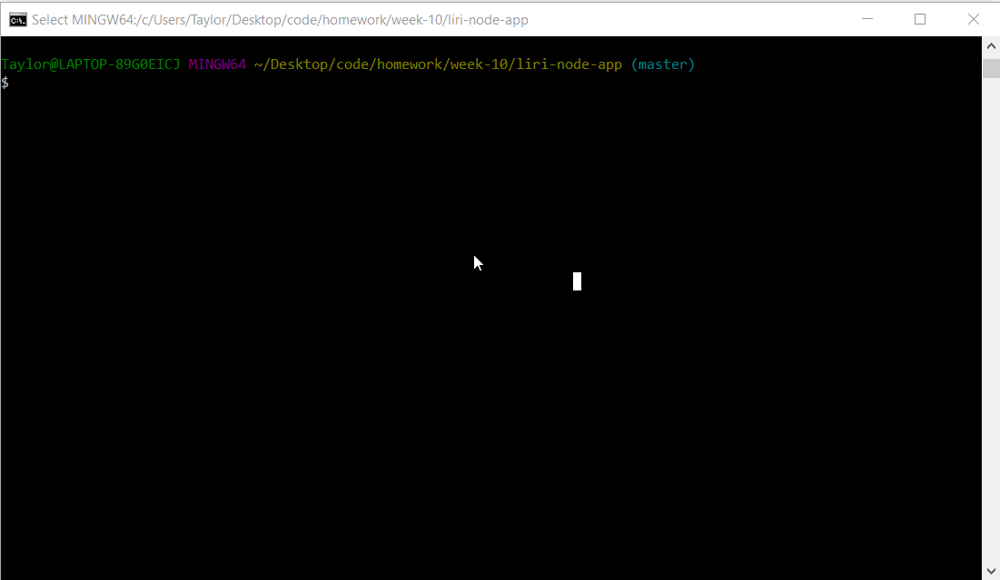
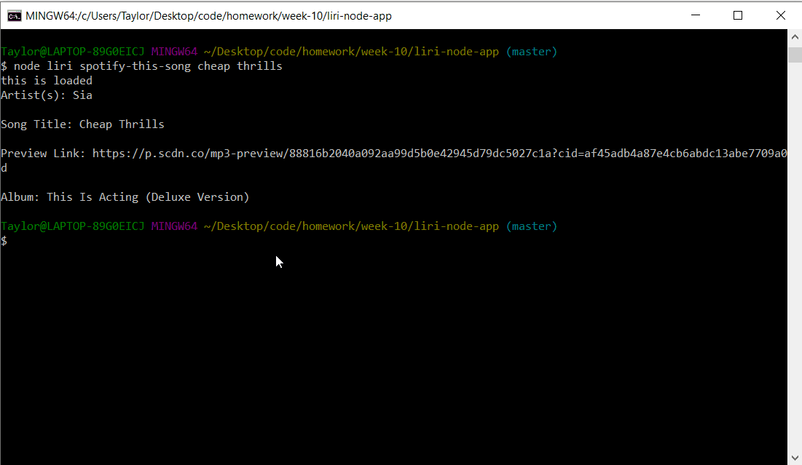
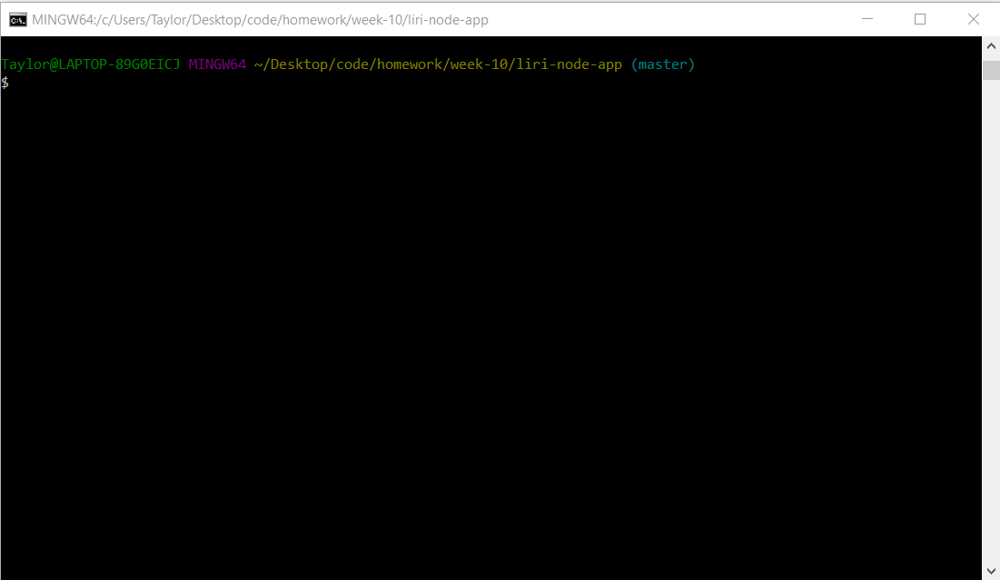
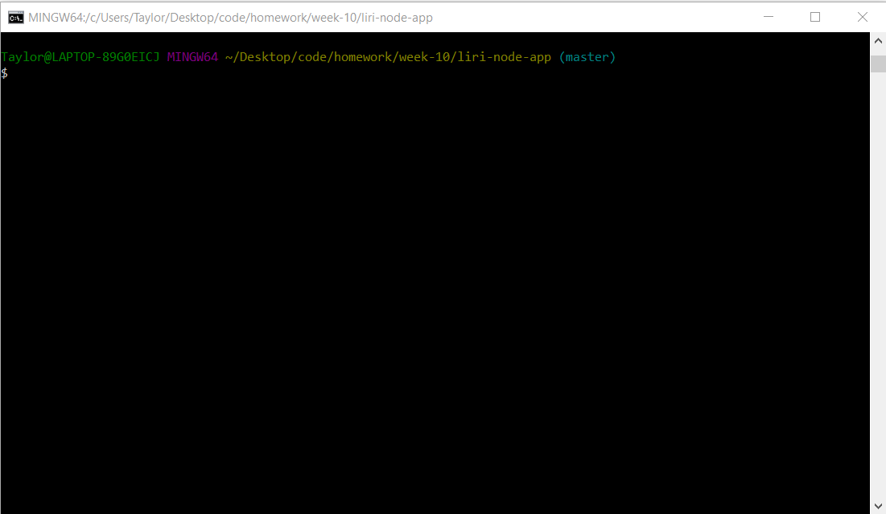

# liri-node-app

A Node JS app that takes the user's input and compiles information based off the prompts the user gives.

To use, your first prompt must be one of the following:
- "spotify-this-song"
- "concert-this"
- "movie-this"
- "do-what-it-says"

Followed by the search criteria you want. Examples are shown below. 

